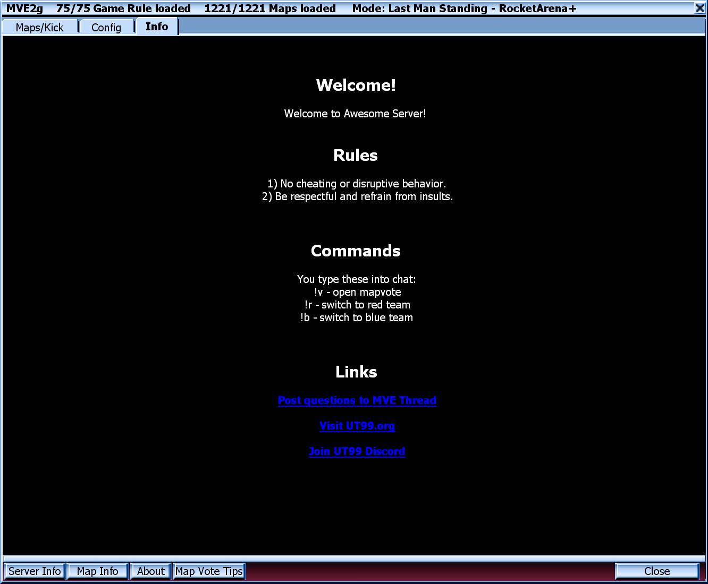

# Map Vote Extended

 - Required UT99 version: 436 or newer
 - **MAX** maps: 4096
 - **MAX** gametypes: 100

**This document is incomplete, but it does document some of the features!**

**For more information also check the changelog, it may be listed there**

Installation/troubleshooting is covered in the separate "Quickstart" file.


## Configuration

Your configuration only file is `MVE_Config.ini`. You will need to familiarize
yourself with `MVE_Config.ini` as it's the only way to configure MapVote. 
You'll need to learn and undestand how it's structured.

Use your favorite text editor and possible one that has syntax highlighting
for `ini` files. For example VsCode(ium) works out of the box. If you're using
notepad++ you may use the custom syntax provided with this MapVote which 
enhances ini highlighting for UT99. This can help avoid mistakes and typos
which are unfortunately silent errors when running UT99.

It's good pracitce to make backups of this file once you have a working 
configuration make a copy of it and give it a name.

A good workflow is:

1. Close server
2. Edit MVE_Config.ini
3. Restart server
4. Test the changes

It's recommended to make small changes and to test them often. Once you start
gain a bit of understanding, you'll be able to make larger changes with 
confidence, but until then make the smallest changes and see what it does. 


## Travel State

MapVote holds between map switches in a special file called `MVE_Travel.ini`
If mapvote crashes or if the current map is deleted it's possible for this 
file to contain instructions to switch to a map or load a gametype for which
the packages no longer exist. This can cause a crashloop where mapvote will 
keep trying to switch to the map that does not exist.

To reset the travel state simply vote for a mode and map and which works. If 
it's not possible to bring up mapvote anymore then an admin needs to delete 
the `MVE_Travel.ini` file and restart the server to start from a clean state.


## Map Lists (aka FilterCode)

Every gametype you configure requires a list of maps. The list of maps to be 
used for a gametype is specified via the `FilterCode` property. 

```ini
CustomGame[19]=(GameName="DeathMatch",FilterCode="DMlist", ... )
CustomGame[20]=(GameName="Assault",FilterCode="ASlist", ... )
```

If you want two gametypes with the same list of maps, use the same FilterCode.

```ini
CustomGame[19]=(RuleName="Low Grav",FilterCode="DMlist", ... )
CustomGame[20]=(RuleName="InstaGib",FilterCode="DMlist", ... )
```

There are multiple types of filters which can be combined together.
MapVote supports having multiple include and exclude filters on the same
FilterCode and filters can be a simple wildcard file match or a combination 
of tags. There is also a special mode when you want very specific manual 
control over the order of the maps.


## Map Wildcard Filter

The simple-est way to use MapVote is with wildcard file prefix filters. 
You can just set up which maps to grab based on how the filename starts.
Since UT99 maps are prefixed with the gametype this is super simple to set 
up multiple gametypes.


```ini
MapFilters[0]=DMlist DM-*
MapFilters[1]=ASlist AS-*
MapFilters[2]=DOMlist DOM-*
MapFilters[3]=CTFlist CTF-*
```

Using this workflow, whenever you need to add new maps to the server, you need
to install the new files and run the map reload command and they will be 
instantly picked up.


## Map Tag Filters

In order to add more flexibility to the way map lists are built, it's also
possible to tag specific maps. You can assign multiple tags per map.

For example `DM-CliffyB4:RA` could mean that the map DM-CliffyB4 is suitable
for rocket arena and that `CTF-Whatever:LG:SNI` is suitable for lowgrav and
sniper matches. What the tags are and what they mean are up to the user.

Filters have been extended to support tags. This way maps with specific
tag can be added or removed from map lists using the filters.

To enable this feature you need to set `bEnableMapTags` to true in the
`[MVES.MapVote]` section of `MVE_Config.ini`

Configuration example follows, note the following features:
 - both maps and filters have multiple tags at the same time
 - dm1on1 filter matches maps that are both :SMALL and :DM
 - dmlowgrav filter matches maps that are both :LG and :DM
 - dmsniper is either :LARGE:DM maps or :LG:DM maps
 - dmnolowgrav contans all DM-* maps excluding maps tagged :LG

```ini
[MVES.MapVote]
bEnableMapTags=True
CustomGame[0]=(RuleName="Normal",FilterCode="dmnolowgrav", ...)
CustomGame[1]=(RuleName="1on1",FilterCode="dm1on1", ...)
CustomGame[2]=(RuleName="Low Gravity",FilterCode="dmlowgrav", ...)
CustomGame[3]=(RuleName="Sniper",FilterCode="dmsniper", ...)
CustomGame[4]=(RuleName="Medium Sized",FilterCode="dmmedium", ...)
MapFilters[0]=dm1on1 :SMALL:DM
MapFilters[1]=dmlowgrav :LG:DM
MapFilters[2]=dmsniper :LARGE:DM
MapFilters[3]=dmsniper :LG:DM
MapFilters[4]=dmmedium :MEDIUM:DM
MapFilters[5]=dmnolowgrav DM-*
ExcludeFilters[0]=dmnolowgrav :LG

[MVES.MapTagsConfig]
MapTagsVersion=1
MapTags[0]=DM-Fractal:DM:SMALL
MapTags[1]=DM-Morbias][:DM:SMALL
MapTags[2]=DM-HyperBlast:DM:SMALL
MapTags[3]=DM-Stalwart:DM:SMALL
MapTags[4]=DM-Deck16][:DM:MEDIUM
MapTags[5]=DM-Crane:DM:LARGE
MapTags[6]=DM-Morpheus:DM:MEDIUM:LG
```

The downsides of this is that if you use this was to configure map lists,
every time you want to add a map to the list you need to add an entry to 
`MVE_Config.ini` to that the map. Map lists built with tags require more
maintenance.


## Premade Map Lists

For coop campagins or for any other gametype where the order of maps needs
to be manually set up, premade lists can be used. When you make a premade
the number and order of the maps will be exactly as you set them up in the
configuration file. 

You will first need a gametype, let's call it Coop, but it can be anything else
and create a new FilterCode. The filter code can be customized but it must
start with `premade`, so for example `premadeRTNP` or `premadeDK` are fine,
in this example we'll go with `premadeA`.

```ini
CustomGame[33]=(GameName="Coop",FilterCode="premadeA",bHasRandom=False,...)
```

Next, in the map filters, you will need to list the maps you want in the premade
list.

```ini
MapFilters[20]=
MapFilters[21]=premadeA DM-Malevolence
MapFilters[22]=premadeA DM-Liandri
MapFilters[23]=premadeA DM-StalwartXL
MapFilters[24]=
MapFilters[25]=
```

As long as the convention above is respected, they will be picked up by the 
special premade filter in the order given in the config file, and will not
be sorted alphabetically.


## MapOverrides

Map overrides feature can be used to configure things that happen when a 
specific map is voted. Currently supported properties are:

- `Song` - you can override the song of a level if you don't like it or the
  if the author forgot to add one (happens to the best of us). For example you can
  use the secret song `?Song=Organic.Organic`

- `MutatorList` - you can add extra mutators which spawn only when a map is 
  voted, you can use this for example to alter the gravity of some maps by 
  spawning `?MutatorList=Botpack.LowGrav`

To enable this feature you first need to set `bEnableMapOverrides` to true in the
`[MVES.MapVote]` section of `MVE_Config.ini`


```ini
bEnableMapOverrides=True
```

Recommended to also have `bOverrideServerPackages` set to True so that MVES can 
take control over `ServerPackages` to be automatically populated with the 
referenced song packages. Otherwise you need to manually add all necessary packages 
to `ServerPackages` in the `[Engine.GameEngine]` section of `UnrealTournament.ini`

Configuration Example:

```ini
[MVES.MapOverridesConfig]
MapOverridesVersion=1
MapOverrides[0]=DM-Deck16][?Song=Organic.Organic?MutatorList=Botpack.LowGrav
MapOverrides[1]=DM-Gothic?Song=Mannodermaus-20200222.20200222
MapOverrides[2]=Song==Phantom.Phantom?Song=X-void_b.X-void_b
```

## Random Gametype/Rule aka Random Random

To enable this configure GameName or RuleName property to "Random" and 
recommended to also have bHasRandom=True this will make it possible for 
players to select a random game with random rule with random map. 

```ini
CustomGame[48]=(bEnabled=True,GameName="Random",RuleName="Random",GameClass="Botpack.DeathMatchPlus",FilterCode="xrandom",bHasRandom=True, ...)
```

After this option gets voted mapvote will first randomly pick a random 
gametype. GameClass does not matter. FilterCode is best to have a filter
with 0 maps. bHasRandom=True should be set so that a random map is chosen.


## Configuration reuse via aliases

When configuring a lot of gametypes you'll notice that you're repeating the 
same configuration over and over again. You can reduce the repetition by 
reusing parts of configuration. This can be done using aliases.

Aliases are basically shorthands that get replaced with a longer definition.
You can reference an alias from the MutatorList.

When the configuration is loaded, the alias will be substituted based on the 
alias definition. Please note that this is basic text substitution and you 
will have to ensure that the commas are in the right place after substitution.

```ini
CustomGame[7]=(GameName="CTF",MutatorList="<lgsniper>",...)
CustomGame[8]=(GameName="DM",MutatorList="<lgsniper>",...)
Aliases[0]=<lgsniper> Botpack.LowGrav,BotPack.SniperArena
```

The configuration above is same as manually typing out all the mutators as 
seen in the configuration below:

```ini
CustomGame[7]=(GameName="CTF",MutatorList="Botpack.LowGrav,BotPack.SniperArena",...)
CustomGame[8]=(GameName="DM",MutatorList="Botpack.LowGrav,BotPack.SniperArena",...)
```

The following configuration properties support aliases:

- MainServerActors
- CustomGame[n].ServerActors
- CustomGame[n].ExcludeActors
- MainMutatorList
- CustomGame[n].MutatorList
- CustomGame[n].ExcludeMutators
- MainServerPackages
- CustomGame[n].ExcludeMutators
- DefaultSettings
- CustomGame[n].Settings
- DefaultUrlParameters
- CustomGame[n].UrlParameters
- CustomGame[n].GameClass
- Aliases[n]

The aliases are recursively resolved. This is a fancy way of saying that an 
alias can be used inside another alias. In practice what this means is that 
you can have shared configuration reuse within the aliases themselves.

```ini
Aliases[0]=<lgsniper> BotPack.SniperArena,<lg>
Aliases[1]=<lgrocket> BotPack.RocketArena,<lg>
Aliases[2]=<lg> Botpack.LowGrav
```

The syntax for defining an alias is either `<key>=value` or `<key> value`.
The first one is the way aliases were used in previous versions of mapvote so
we'll keep it for backwards compatibility.

It's possible to use aliases without the `<>` characters but this is not 
recommended. Having this naming convention enables optimizations and it also 
makes the configuration more readable.


## Configuring ServerPackages per Gametype

MapVote can take control over managing ServerPackages for you this allows
you to optimize you packages configuration to only make the clients download
what is needed only for the current gametype instead of requiring clients to
preload everything for the whole server. This feature is emabled via the 
`bOverrideServerPackages` flag.

- bOverrideServerPackages=False
  -> You edit ServerPackages inside UnrealTournament.ini

- bOverrideServerPackages=True 
  -> You edit ServerPackages inside MVE_Config.ini

If your MainServerPackages is empty then MapVote will extract the
packages for you from UnrealTournament.ini and populate the list. Otherwise 
you need to make sure the server packages are correcly set up. Here is an
example for a correct value.

```ini
MainServerPackages=("SoldierSkins","CommandoSkins","FCommandoSkins","SGirlSkins","BossSkins","Botpack")
```

Then in each CustomGame you can add additional packages on top which will 
then only be applied when that particular custom game is being played. And then
players would only need to download the additional packages when playing that 
gametype.

```ini
CustomGame[4]=(RuleName="Classic",Packages="", ...)
CustomGame[5]=(RuleName="Relics",Packages="Relics", ... )
```

### UrlParameters

Additional URL parameters can be added added to the travel string separately
for every game type. Some mutators can be configured via URL parameters.
For mutator developers this is useful because the travel string can be read
during initialization to load up a configuration.

```ini
DefaultUrlParameters=Key1=ValueDefault1?Key2=ValueDefault2
CustomGame[6]=(UrlParameters="Key1=Value1a?Key2=Value2a", ... )
CustomGame[7]=(UrlParameters="Key1=Valie1b", ... )
```

### Populate ServerPackages for Known Properties

When `bOverrideServerPackages` is enabled then mapvote will automatically 
detect and populate packages from the following properties:

 - ClientLogoTexture
 - ClientScreenshotPackage
 - ClientPackage
 - Package of the GameClass
 - Package of the Song when using MapOverrides

This means you dont have to manually set these server packages. Note that
package changes are applied when a new map is voted through MapVote.

Package changes are logged to server log and you can also check in 
UnrealTournament.ini that they were correctly applied.


<!-- ## Screenshot Bundle [EXPERIMENTAL]

In order to have screenshot and level summary for every level in the map,
there is an experimental feature in place that allows players to load 
screenshots from a dedicated package which contains all screenshots for 
the levels. -->


## Configurable TickRate per gametype

There is an option `TickRate` for each GameConfig. There is an option to set
a `DefaultTickRate` globally for all gametypes.

There a special default value `0` which is treated as tickrat enot set. If 
you don't want mapvote to modify the tickrate then use this `0` default value
everywhere.

If `TickRate` is has value 0 on a gametype then `DefaultTickRate` is used and
if that is also value 0 then mapvote will not set any tick rate.

Since this setting affects the whole server, whenever mapvote changes the tick
rate it will log this event into the server log. If you're not sure why your
tickrate is a specific value, check the server log to see if mapvote is the 
one changing it to something else.


## Mutators and ServerActors configuration

Mapvote can spawn server actors and mutators. It's recommended to set up all
your server actors and mutators through mapvote. The advantage is that they
can be configured individually per gametype so then depending on which 
gametype is voted the correct set of mutators/actors can be spawned.

There is also global list of mutators/actors that mapvote can spawn these are
configured as a comman separated list in `MainMutatorList` and for server 
actors in the `MainServerActors` property.

On each gametype you have it's own separate list of mutators and server actors
by adding them as a comma separated list inside the `MutatorList` and the
`ServerActors` properties of each gametype.

In case there is a gametype where you do not wish to spawn a mutator or an 
actor then those can be excluded by setting them as a comma separated list
inside the `ExcludeMutators` and the `ExcludeActors` properties. 

Using this you can set up for example mutators that would be spawned every
where except a few gametypes. For example to remove redeemer in general you
can have have the a mutator which removes globally but if you have a gametype
where you need the redeemer then you can add it to the sclude proeprty of a 
particular gametype.

```ini
MainMutatorList=Botpack.NoRedeemer
CustomGame[7]=(MutatorList="SLV203.StrangeMutator",ExcludeMutators="Botpack.NoRedeemer")
```

## Logo Texture 

Since mapvote automatically selects a map this feature is not that important
anymore as in a properly configured mapvote the logo would rarely be 
displayed.

A logo texture can now be configured and shown. The mapvote will instruct
all windows to show this texture initially before players select a map.

Example:

```ini
[MVES.MapVote]
ClientLogoTexture=Botpack.ASMDAlt_a00
```

## Welcome Window

Mapvote has a feature for welcoming new players to the server. This feature
is option and can be enabled by settings `bWelcomeWindow=True` This will make
a window pop up for new players on the server which will show the server info 
page.

The contents of the server info page is loaded from a HTTP server. If you have
a redirect running (which you should) then you can put a basic static HTML
page inside your redirect. And example page is provided, check the 
`server-info.html` file.

For the client to load the content you need to configure the `ServerInfoURL`
property with the URL of the page. Note that the URL should be using the 
HTTP protocol, not HTTPS. HTTPS is not supported. Also not that only very
basic formatting can be used.

The `ServerInfoVersion` is used by the clients to remember if the content was
shown or not. This value can be changed by server admins to force display the
welcome info page for all the players for example to publish changes or 
notifications.

When `bServerInfoRequiresAccept` is enabled a checkbox will be shown to 
players and it will be required for players to check the checkbox. Players 
will keep getting the information window until it is checked. 

Using `ServerInfoAcceptLabel` the text label can be customized. Note that when
left empty a fallback value is used if the checkbox feature is enabled.

Here is an example screenshot of how this looks in practice:

  

The above is done using this configuration. 

```ini
bWelcomeWindow=True
ServerInfoURL=http://127.0.0.1:8080/server-info.html
ServerInfoVersion=1
bServerInfoRequiresAccept=True
ServerInfoAcceptLabel=I accept the rules
```

You will ofcourse need to host your own rules file and put the URL there which
can be accessed from over the internet. In the example above I use localhost
which would only ever work on the local machine.


# Configuration reload during map list reload

By setting `bReloadConfigDuringReload=True` mapvote will first reload the 
config then reload the map list. 

This is a 469 feature that would need a 469d or newer server. But it can be a
convenient feature for server admins to reduce the number of server reloades 
needed to be done. 

This feature enables a workflow where server admins can edit `MVE_Config.ini` 
with notepad then alt tab to the game and hit the reload hotkey to apply the 
changes to the server without needing to shut down and restart the server 
between each edit.


## Configurable Shutdown on travel

When the match ends and the next match is being set up by MapVote, there is now
an option for MapVote to exit the server process. This can be used for more
advanced server control script to essentially have 1 process per match and
allows logs to be separated by match.


## Client side caching

This mapvote uses client side caching for map lists. This feature makes 
mapvote feel really fast as in general case it will only need to load a local
stash of map lists.

For caching the `ServerCodeName` is used as a cache key.
  
If you're running multiple servers and they have different lists, make sure 
there is a unique `ServerCodeName` value for each server. Otherwise server-A 
will overwrite the cached data for server-B.

But if all your servers have the same identical map then it's beneficial to
use the same `ServerCodeName` for all servers this will make the players 
only need to download the map list on the first server and players switching
between servers will instantly have the map list ready and loaded.

The defautl value for `ServerCodeName` is empty and in the example confiv an
empty value is provided as well, this is because when mapvote first loads it 
will auto generate a unique key so that server admins who don't read this
readme will have good defaults, as, in having a unique key that does not 
collide with other servers.


## Fix net news and master server for clients

When `bFixNetNewsForPlayers=True` the client side mapvote will apply a patch
to players if they still have the discontinued epic games masterserver 
configured. This means that for joining players with an old clientwill auto
matically get their settings patched to allow them to use the server browser.
This feature is enabled by default but can be disabled.


## Notes on Compatiblity

There was extensive work on compatibility so that MapVote could basically load
any gametype that exists for UT99


### Coop and HUB level compatibility

Normally MapVote controls and initiates server travel. When players vote a
map MapVote will initiate a server travel with correct parameters then after
the new map loads MapVote applies settings and spawns mutators.

When a travel is initiated outside of MapVote then this should be detected
by MapVote, it would allow the travel to happen and then it re-applies all the
gametype settings from the map before the travel.

This makes it possible to play coop single-player campaigns or any other 
gametype which temporarily needs to apply a server travel. 


### Assault compatibility

In assault during part 1 red team attacks blue team defends and part 2 the 
attack defend roles as swapped. Part 1 and part 2 are separated by a server
travel initiated by the assault gametype.

The two parts of assault matches works throught the same travel detection
mechanism that makes coop work by letting the assault gametype control the 
ending of the match. MapVote will then reset the assault properties so the 
next match can start cleanly.

Subclasses of `Botpack.Assault` (such ass league assault) are supported.


### Always handle MonsterHunt end

Fixed a bug where was a bug where MapVote interface would never show up at the
end of MonsterHunt games. The issue here was MapVote wrongly checking for tie
between players in monster hunt games as MonsterHunt is actually a tem game


### Improved JailBreak compatibility

Players that rejoined during a JailBreak could not vote because of how the
player detection was implemented in older versions of MapVote. This is fixed 
by having player detection run in a timer loop, so at fixed intervals the 
server checks and adds players to the mapvote who were previosely not added.
This ensures that all players can vote.


