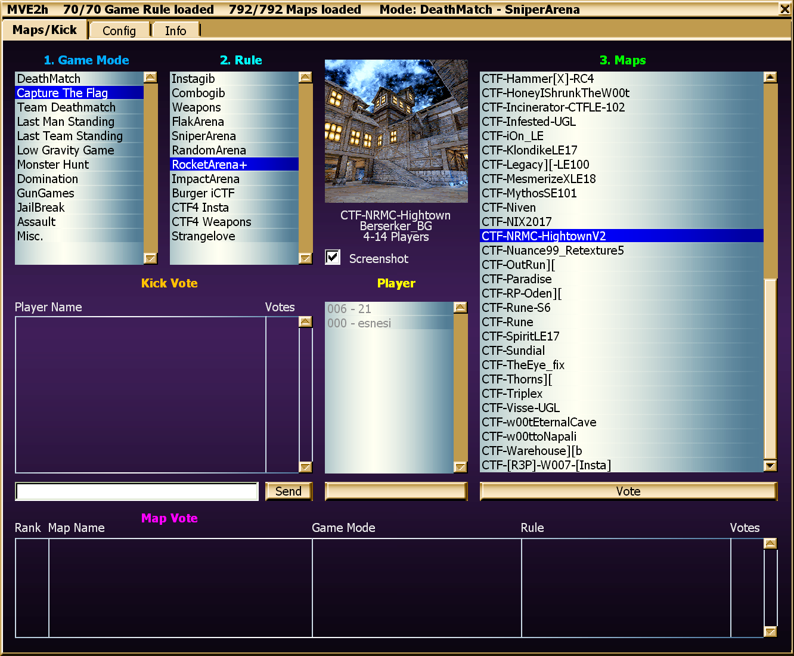

# MVE - Map Vote Extended

MapVote lets players to choose the next gametype and map when a match ends.

Map management:
 - include/exclude filters
 - map prefix filter
 - map tags filter
 - premade lists

Compatible with:
 - Assault (including LeagueAssault)
 - Jailbreak (fixed spectator bug)
 - Coop campaigns with fixed map order
 - DeathMatch, CTF & Domination
 - MonsterHunt
 - BunnyTrack

Important Features:
 - ServerPackages set per gametype, players only download what's needed for 
   the current gametype.
 - Mutators, ServerActors, settings are all configurable individually 
   for every gametype.
